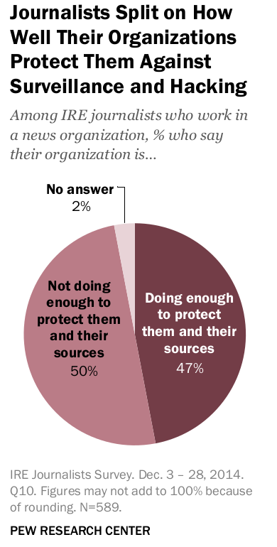

<!-- .slide: data-state="no-toc-progress" -->
<!-- don't show toc progress bar on this slide -->

### Journalism
#### after
## Snowden

 What's the progress?

---

# ✋ questions
When you have one

The idea is to spark discussion

notes:
  - the idea is to spark a conversation about the security of
    journalists and how we can help improve it

--- ---

# Why is it important?

notes: 
I guess it's easy to understand that good e

---

"News is something someone somewhere doesn't want printed"

-- Lord Nothcliffe

notes:
Media is incredibly important for democracy:
  - makes people aware of what is going on
  - creates accountability
  - exposes unfairness

--- ---

# Under threat

notes:

Being under threat is nothing new for news organizations. An industry
that is based on exposing unfairness cannot go without making powerful
enemies.

---

# Everything went digital

|                    | Before                    | After                               |
|--------------------|---------------------------|-------------------------------------|
| Contact w/ sources | postal service / by word  | social media, email, messaging      |
| editing documents  | on paper/offline computer | online computer or even "the cloud" |
|                    |                           |                                     |

---

Every journalist should understand that there is no such thing as
confidential digital communication. 

**None of us have confidential sources.**

 

--  [Alan Rusbridger, The Guardian editor](https://www.pressgazette.co.uk/rusbridger-how-no-journalists-sources-are-now-safe-joining-ipso-and-why-he-would-have-kept-news/)

--- ---

### Ethical imperative:
# Source protection

notes:

Journalists' job relies on assuring source that they can preotect
their identety. If jounralists start failing at that 

Protecting sources is a moral obligation of journalists as source
often only speeak under the condition of anymoity for feal of
physical, economic of profession reprisals in reponse to their
revelations.

---

#### Can journalism 

##  without source protection

#### really

## be called journalism

# ?

---

# Some examples

notes:

  Let's see some practical examples on how, because of the digital
  nature of the world surveillance of jounalists was feasible
  

---

### NSA spying on German media

notes: 

> In the summer of 2011, the CIA station chief in Berlin asked one of
the most powerful intelligence officials in Germany to go on a private
walk with him, the German newsmagazine Der Spiegel reports. The
American spy had an important message to convey: one of Germany’s own
senior officials was leaking information to the press.

after that the leaker was demoted

We know about this 4 years later thanks to the Snowden leaks

sources:
  - (german) https://www.spiegel.de/politik/deutschland/der-spiegel-ist-im-visier-von-us-geheimdiensten-a-1041985.html
  - https://theintercept.com/2015/07/03/after-spying-germany-cia-outs-leaker/

---

### The NSA also surveilled

BBC, The Guardian, Le Monde, Reuters, The
New York Times and The Washington Post

[source](http://www.theguardian.com/uk-news/2015/jan/19/gchq-intercepted-emails-journalists-ny-times-bbc-guardian-le-monde-reuters-nbc-washington-post)

---

### Citizenlab Report

Mexican Journalists targeted by NSO malware

  <h6>source:https://citizenlab.ca/2017/06/reckless-exploit-mexico-nso/</h6>

--- ---

# No more sources?

notes:

- Most souces are not like snowden. They don't have the knowledge of
 how to protect their communications with journalists and because of
 that.

- in a study conducted by HRW (Human Rights Watch) where 46 national
  security journalists were interviewed, they reveilld that their
  sources were less willing to talk because of the surveillance
  (https://www.hrw.org/report/2014/07/28/liberty-monitor-all/how-large-scale-us-surveillance-harming-journalism-law-and)

---

--- ---

(General) Threat model for

## Investigative journalists

---

# Threats

What are the main threats for

**investigative journalism** ?

 

of course it always depends on the threat model<!-- .element: class="fragment" --> 

notes:

  But even depending on the threat model, certain threats should be
  mitigated

---

### Key problem
## Electronic evidence

1. communications are mediated
2. physical surveilance
3. weak devices

notes:
  - this classification is made by the original author of this
    presentation and not in bibliographic sources

---

### Mass surveillance

and

### Targed surveillance

example:

notes:

   investigative journalists have always been targeted by phiscall
   surveillance, but now with cheap software and hardward, with
   boundless scalability, mass surveillance is feasible.

---

## #1
### Communications are
### mediated

---

#### Metadata 

Often as a consequence of *mass surveillance*

image credits: [Surveillance Self Defense, EFF](https://ssd.eff.org/en/module/why-metadata-matters)

notes:
  - maybe even more imporant than the communications themselves

---

#### Third-party
## Data Retention

 

Online surveillance<!-- .element: class="fragment" --> 
  - search engine<!-- .element: class="fragment" --> 
  - online tracking<!-- .element: class="fragment" --> 
  - social media<!-- .element: class="fragment" --> 

use of thrid-party tools<!-- .element: class="fragment" --> 
  * slack<!-- .element: class="fragment" --> 
  * google suite<!-- .element: class="fragment" --> 

sources reach out though thrid-party platforms<!-- .element: class="fragment" --> 

NOTES:
  TODO - add reference from papers on the subject

---

## #2 
### Physical
### Surveillance

notes:
  - physical surveillance technology is relatively cheap/compulsory
  - employee bades -log the time
  - cctv - can be used to see who the journalist meets
  - ALPRs

---

## #3
## Weak
## Devices

 (endpoint-security)

notes:
  - usually out of date
  - do not protect us from ourselves (i.e. clicking a link)
  - overlogging - forensic analysis 

---

#### increasingly pro-surveillance
### Legal Frameworks

 

Legal protections overridden by national security and anti-terrorism legislation<!-- .element: class="fragment" --> 

  

source: [J. Poseti, Protecting journalism sources in the digital age. 2017. page 9](http://unesdoc.unesco.org/images/0024/002480/248054E.pdf)

---

### Outdated
#### Legal Frameworks

 

1. Legal grey area on what digital proof is admissible in court cases<!-- .element: class="fragment" --> 

2. Outdated protections for source material <!-- .element: class="fragment" --> 
 (It's now digital but it may not be covered)<!-- .element: class="fragment" --> 

3. Who is entitled for protection changed<!-- .element: class="fragment" --> 
 "The People Formerly Known as the Audience"<!-- .element: class="fragment" --> 

  

source: [J. Poseti, Protecting journalism sources in the digital age. 2017. page 9](http://unesdoc.unesco.org/images/0024/002480/248054E.pdf)

note:
  - > "The People Formerly Known as the Audience"
  - the famous phrase illustrates well the change in journalism
  - the defnition of journalism has broadened. The research recommends
    shifting focus from legislation about "journalism" to "acts of
    journalism" for source protection.

---

# Adversaries
Who do journalists what to be protected/project sources from?

notes:
  - TODO add consequnces

---

what are the
# Consequences
### of failing security?

---

#### Source exposure

Identity of the source revealed

 leading to chilling effects on sources <!-- .element: class="fragment" --> 

---

#### Leakage of source material

What if... Snowden docs leaked?

notes:
  - Not all should be publshed. Not all Snowden documents balance so
    well the importance to the public with the risks of
    individuals. Some things should not be published. Imagine what
    would happen if all of them got dumped like in wikileaks.

---

#### Pre-publication
exposure of journalistic investigations 
- cover-ups<!-- .element: class="fragment" --> 
- intimidation<!-- .element: class="fragment" --> 
- destruction of information<!-- .element: class="fragment" --> 

notes:
  - source http://www.unesco.org/new/fileadmin/MULTIMEDIA/HQ/CI/CI/pdf/news/protecting_journalism_sources_in_digital_age.pdf

--- ---

# Challenges

Challenges highlighted by journalists and researchers

notes:
  - security is not usable

---

### Financial Costs

 

digital security trainings<!-- .element: class="fragment" --> 

digital security tools<!-- .element: class="fragment" --> 

legal advice<!-- .element: class="fragment" --> 

read more:<!-- .element: class="fragment" -->  [@julieposetti medium post](https://medium.com/@julieposetti/it-s-back-to-the-dark-car-park-for-many-investigative-journalists-f098ca569e46)<!-- .element: class="fragment" --> 

notes:
  - to add to this, newrooms are now in finacial structure due to the
    chagning business models

---

### Source-driven

Sources dictate communication methods

notes:
  - source McGregor, S.E. et al. Investigating the Computer Security Practices
and Needs of Journalists

---

### Opening
### documents

📄

notes:
  - it's an investigative journalist's job quite literally. So you
    must make sure it doesn't get in the way of journalists.

---

### Journalistic
### Autonomy

 Newsrooms offload source security 

decisions to journalists

notes:
  - from the research, newsrooms offload source security decision to
    the journalists and may not have a legacy of providing training
  - This leads to many journalists turning to free cloud services and
    tools
  - source: McGregor, S.E. et al. Investigating the Computer Security Practices
and Needs of Journalists
  - source: Watkins, E.A. et al. Creative and Set in Their Ways:
    Challenges of Security Sensemaking in Newsrooms

--- ---

### Journalists
## are interested

</img>&nbsp; &nbsp; &nbsp; &nbsp; 

source [PEW Research](https://www.journalism.org/2015/02/05/investigative-journalists-and-digital-security/)

notes:

  Pass to the audience the idea that digital security training is
  something the journalists have expressed that they need.

---

</img>&nbsp; &nbsp; &nbsp;&nbsp;</img>

source [PEW Research Investigative Journalists and Digital Security:
Perceptions of Vulnerability and Changes in Behavior](https://www.journalism.org/2015/02/05/investigative-journalists-and-digital-security/)

--- ---

## Good examples

notes: 

Let's talk about some newsrooms that take security seriously

---

notes:

 - security and privacy culture since day one
 - have staff dedicated to digital security

---

* [Meet the Man Hired to Make Sure the Snowden Docs Aren't Hacked](https://mashable.com/2014/05/27/micah-lee-greenwald-snowden/?europe=true)

---

> Lee’s position is rare in the media world. But in the age of secret-spilling and the government clampdown on reporters' sources, news organizations are aiming to strengthen their digital savvy with hires like him.

--- ---

<!-- SECURE DROP -->
<!-- .slide: data-background-image="images/securedrop-hexagons-background.png" -->

 

---

<!-- .slide: data-background-image="images/securedrop-news-orgs.png" -->

---

# Objective
Protect sources in the era of mass surveillance

---

---

Another objective is also the
# safety of journalists

note:

- for example the files sent to the by fake sources can be actually
  malicious actors

---

<!-- .slide: data-background-image="images/securedrop-hexagons-background.png" -->

Securedrop
# Workstation

<!-- announcement https://securedrop.org/news/road-towards-integrated-securedrop-workstation/ -->

---

<!-- .slide: data-background-image="images/securedrop-hexagons-background.png" -->

 Soon to come. In development since July 2017 

--- ---

# Success case

Large international collaboration<!-- .element: class="fragment" --> (100-400 ppl.)

note:
  The panama papers
  - TODO find image credit

---

### Panama Papers

</img>
*fig. countries implicated in the scandal*

image credit: [Jay Coop, wikimedia commons](https://en.wikipedia.org/wiki/Panama_Papers#/media/File:Countries_implicated_in_the_Panama_Papers.svg)

notes:
  - TODO short intro to panama papers
  - explain that having access to 2TB of data is something that could
    have never happened in an pre-digitize era. So not all is lost
    with investigative journalism

---

### Pre-publication leaks

notes:
  - how they avoided this

---

# Research

notes:
  research from https://www.usenix.org/system/files/conference/usenixsecurity17/sec17-mcgregor.pdf

--- ---

# Conclusions

---

In most western democracies
# Source protection is safeguarded

 But surveillance technologies overrides that

---

#### Desperate need for 
- digisec trainings for journalists
- funding for journalist tools

--- ---

# Learn more

recommendations for those interested

---

---

This study covers the period 2007-2015, and builds on a 2007 study
produced by Privacy International (Banisar 2007).

---

---

# Thank
#  you

---

--- ---

# Unused slides

---

# No passado

Jornalistas podiam proteger as suas fontes simplesmente não as revelando quando interrogados.

---

# Já não se aplica

Tudo deixa um rasto digital!

note:
alguns exemplos são:
* chamadas telefónicas
* documentos apagados
* emails

---

</img>

# Vigilância Moderna
  

- massificada
- barata
- ubíqua

---

### Jornalismo sem proteção de fontes 
## pode ser considerado jornalismo?

Questão central

---

<!-- .slide: data-background-iframe="https://theintercept.com/2019/08/04/whistleblowers-surveillance-fbi-trump/" -->

Artigo de introdução ao tópico:
https://theintercept.com/2019/08/04/whistleblowers-surveillance-fbi-trump/

note:
não haverá tempo para cobrir isto mas fica aqui à disposição da audiência

---

<!-- .slide: data-background-iframe="http://www.theguardian.com/uk-news/2015/jan/19/gchq-intercepted-emails-journalists-ny-times-bbc-guardian-le-monde-reuters-nbc-washington-post" -->

# GCHQ captured emails of journalists
[from top international media ](https://www.theguardian.com/uk-news/2015/jan/19/gchq-intercepted-emails-journalists-ny-times-bbc-guardian-le-monde-reuters-nbc-washington-post)

--- ---

# Segurança
Informática

note:
segurança é algo contextual. Depende sempre do que se está a investigar e de quem poderá estar interessado em evitar essa publicação

---

# OPSEC

Segurança Operacional

---

--- ---

# Learn more

* [Qubes Website](https://qubes-os.org)

* [A Guide to Protecting Your Privacy for Journalists, Sources, and Everyone Else](https://github.com/freedomofpress/encryption-works/blob/master/encryption_works.md)

* [Investigating the Computer Security Practices
and Needs of Journalists](https://www.usenix.org/system/files/conference/usenixsecurity15/sec15-paper-mcgregor.pdf)

---

--- ---

--- ---

# Unused Slides

---

# 📋 Clipboard

copiar `ctrl-c`

copiar partilhado: `ctrl-shift-c`
<!-- .element: class="fragment" --> 

colar partilhado: `ctrl-shift-v`
<!-- .element: class="fragment" --> 

colar `ctrl-v`

---

- **Fontes Jornalísticas**
<!-- .element: class="fragment" -->
- documentos de investigações atuais
<!-- .element: class="fragment" -->
- e passadas
<!-- .element: class="fragment" -->

  

- comunicações sensíveis
<!-- .element: class="fragment" -->
- contas online
<!-- .element: class="fragment" -->

--- ---

#### State-of-the-art 
# journalist security

---

#### Caso de Estudo

---

# Spooky action at a distance

notes:

in quantum physics they call this "spooky action at a distance". When
one thing affects another independent of the distance. It turns our
that in the privacy world a very similar mechanism exists. If one
journalistic source gets exposed, the effects propagate to everyone
and then we might see a diminishing number of sources coming to the
press.
